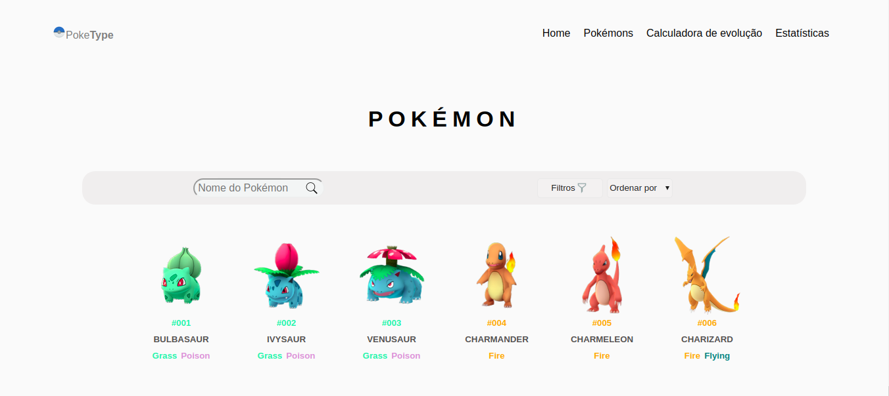
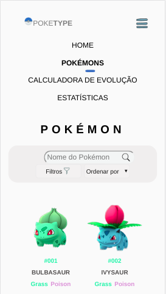
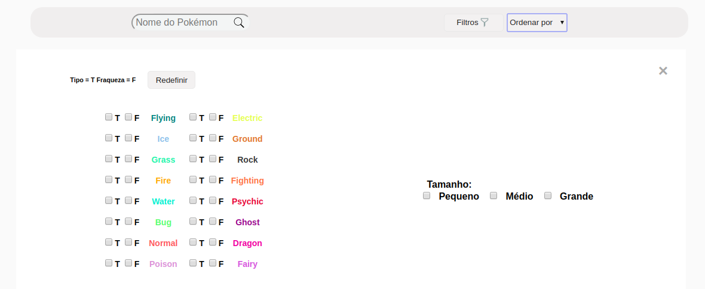
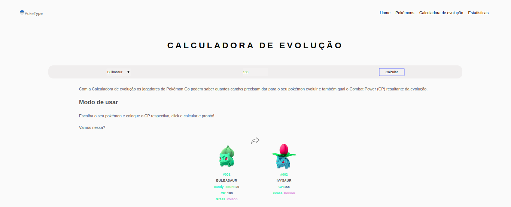
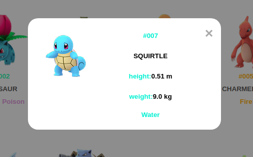

# Data Lovers
## PokeType


## Índice
* [1. Introdução](#1-Introducao)
* [2. Definições do projeto](#2-Definições-do-projeto)
* [3. Protótipo e histórias de usuários](#3-Protótipo-e-histórias-de-usuários)
* [4. Estrutura e funcionalidade](#4-Estrutura-e-funcionalidade)
* [5. Ferramentas](#5-Ferramentas)
* [6. Considerações técnicas](#6-Considerações-técnicas)
* [7. Checklist](#7-Checklist)
* [8. Autoria](#5-autoria)

***

## 1. Introdução
Este projeto consiste na criação de uma aplicação web para jogadores do Pokémon GO(Niantic). A aplicação possui uma interface amigável para que o usuário possa acessar, filtrar e ordenar dados sobre os Pokémons. Os dados estão dispostos em formato de catálogo e podem ser filtrados de acordo com as preferências do usuário. O usuário também pode calcular o CP(*Combat Point*) resultante das suas evoluções. O design é responsivo e está sendo construído pensando na acessibilidade.

## 2. Definições do projeto
O produto é uma aplicação *web* tem como objetivo oferecer ferramentas que auxiliam jogadores do Pokémon GO(Niantic) que buscam informações a respeito dos Pokémons da primeira geração.

### 2.1 Definição  de usuário
Os principais usuários do produto são pessoas que jogam o jogo Pokémon GO(Niantic).

### 2.2 Objetivos
Os objetivos do produto de uma forma direta são:

- Desenvolvimento um catálogo de Pokémons.
- Desenvolvimento filtros que possam auxiliar o usuário a encontrar Pokémons específicos.
- Desenvolvimento de uma calculadora que calcula o CP resultante da evolução do Pokémon escolhido.
- Apresentação dados estatísticos sobre os Pokémons.
- Construção de testes unitários dos códigos.
- Estruturação do projeto de tal forma que ele funcione de maneira responsiva.

### 2.3 Solução
Com os dados da aplicação o usuário pode tomar decisões no jogo de maneira mais assertiva.

## 3. Protótipo e histórias de usuários
Para traçar a intenção e o melhor modo de interação do usuário com a aplicação, foram construídas histórias de usuário e um protótipo de baixa fidelidade.

### 3.1 Histórias do usuário
O projeto foi estruturado em três histórias de usuário.

#### História de usuário 1
Como usuário, quero ser capaz de visualizar um catálogo de Pokémons para que eu possa ver suas características básicas.

#### História de usuário 2 
Como usuário, quero filtrar Pokémons para que possa encontrá-los mais fácil.

#### História de usuário 3
Como usuário quero calcular o CP da evolução dos meus Pokémons.

### 3.2 Protótipo de baixa fidelidade
O protótipo de baixa fidelidade foi construído para testar a disposição dos objetos na página, assim como a usabilidade do usuário, de tal forma que a sua experiência fosse a mais intuitiva possível.


### 3.3. Layout
O layout final teve como inspiração o design do Theodorus Dani no projeto Pokédex web page.

### 3.4. Validação do produto
A validação da aplicação foi feita com um formulário na etapa de protótipo e, posteriormente, com o produto pronto. No primeiro momento, os feedbacks auxiliaram a definir melhor as funcionalidades e layout. Já as respostas do último formulário auxiliaram a verificar com o usuário a usabilidade, a responsividade e os pontos de satisfação e melhoria. 
Segundo as respostas fornecidas por 14 pessoas:
- 85,7% acha que a responsividade está funcionando corretamente.
- 100% conseguiu pesquisar Pokémons por nome e ordenar corretamente.
- 85.7% conseguiu utilizar os filtros com facilidade.
- 100% conseguiu utilizar com facilidade a calculadora de evolução.
- 92.9% conseguiram visualizar bem o gráfico de porcentagem por tipo.
Algumas sugestões de melhoria também foram implementadas, como a mudança de cor de algumas fontes por não estar fácil de enxergar, aumento de contraste da barra de filtro, aumento do tamanho da fonte e centralização de alguns elementos.

## 4. Estrutura e funcionalidade
A aplicação tem uma estrutura clara, objetiva e funciona de maneira responsiva, possuí um menu com quatro opções das quais pode-se navegar pelas funcionalidades oferecidas, que fica visível ou não de acordo com o objetivo do qual ela é acessada.



### 4.1 Home
A aba home oferece informações sobre as funcionalidades da aplicação.

### 4.2 Pokémons
A aba Pokémons possui o catálogo dos Pokémons com as suas imagens e informações básicas, assim como, opções de filtragem e organização, todas as funcionalidades funcionam simultaneamente, ou seja, o usuário pode filtrar e ordenar os Pokémons de maneira dinâmica.

#### 4.2.1 Filtros


##### Filtrar por tipos e fraquezas
A opção de filtrar por tipos e fraquezas apresenta um menu de *checkbox* onde o usuário pode selecionar as opções que deseja filtrar os pokémons.

##### Filtrar por tamanho
A opção de filtrar por tamanho oferece três categorias de pokémons, pequenos médios e grandes.

##### Filtrar por nome
A opção de filtrar por nome oferece um *input* no qual o usuário pode digitar o nome do pokémon desejado, a função começa a funcinar a partir da primeira letra que for digitada.

#### 4.2.2 Ordenar
A opção ordenar possuí  um *select* com quatro formas de ordenação, de A a Z, de Z a A, de forma crescente em relação ao ID e decrescente.

### 4.3 Calculadora de evolução


A calculadora de evolução tem como estrutura um *select* onde o usuário digita o nome do pokémon do qual deseja calcular a evolução, um *input* onde o usuário digita o valor do CP que ele deseja calcular e um botão para iniciar o cálculo.
Como resultado do cálculo a aplicação apresenta pokémon escolhido com os cands necessário para a evolução e o pokémon evoluído com o valor de CP que a evolução renderá.

#### 4.3.1 Exceções
- Quando o pokémon selecionado não possui evolução a aplicação retorna o pokémom selecionado contendo essa informação.
- O Pokémon Eevee pode evoluir para mais de um Pokémon, a aplicação apresenta essa informação e retorna todas as suas evoluções possíveis.

### 4.4 Informações Adicionais
Essa aba possui uma funcionalidade de mostrar os Pokémons disponíveis no Pokémon Go por horário e um gráfico de porcentagem de cada tipo de Pokémon.

#### 4.4.1 Porcentagem de pokémons por tipo
- O cálculo de porcentagem de pokémons por tipo é realizado utilizando os dados do arquivo pokemon.js e apresentado em um gráfico feito com a biblioteca Chartsjs.

#### 4.4.2 Pokémons por horário
- A funcionalidade Pokémons por horário foi feita utilizando os dados de horário local e comparando com o spawn_time, disponível no banco de dados pokemon.js.

#### 4.5 Modal
O modal é aberto clicando no Pokémon quando se deseja saber mais informações sobre ele.



## 5. Ferramentas
Para a construção da aplicação foi utilizado o software Visual Studio Code com a extenção do Node-js. A sua marcação foi feita em HTML e a sua estilização em CSS. Ela foi programada em vanilla JavaScript, contendo dois arquivos, o main.js, responsável pela interação dos elementos do DOM e o data.js responsável pelas funções de filtragem. Os dados foram exportados do arquivo de dados pokemons.js.

## 6. Considerações técnicas

O arquivo está estruturado da seguinte forma:

```text
.
├── EXTRA.md
├── README.md
├── package.json
├── src
|  ├── data (de acordo com o data que forem trabalhar)
|  |  ├── lol
|  |  |  ├── lol.js
|  |  |  ├── lol.json
|  |  |  └── README.md
|  |  ├── pokemon
|  |  |  ├── pokemon.js
|  |  |  ├── pokemon.json
|  |  |  └── README.md
|  |  └── rickandmorty
|  |     ├── rickandmorty.js
|  |     └── rickandmorty.json
|  |     └── README.md
|  ├── data.js
|  ├── index.html
|  ├── main.js
|  └── style.css
└── test
   └── data.spec.js

directory: 6 file: 17
```

## 7. Checklist

* [✓] Usar VanillaJS.
* [✓] Não utilizar `this`.
* [✓] Passa pelo linter (`npm run pretest`)
* [✓] Passa pelos testes (`npm test`)
* [✓] Testes unitários cobrem um mínimo de 70% de statements, functions,
  lines e branches.
* [✓] Inclui uma _definição de produto_ clara e informativa no `README.md`.
* [✓] Inclui histórias de usuário no `README.md`.
* [✓] Inclui rascunho da solução (protótipo de baixa fidelidade) no
  `README.md`.
* [✓] Inclui uma lista de problemas detectados nos testes de usabilidade no `README.md`.
* [✓] UI: Mostra lista/tabela/etc com dados e/ou indicadores.
* [✓] UI: Permite ordenar dados por um ou mais campos (asc e desc).
* [✓] UI: Permite filtrar dados com base em uma condição.
* [✓] UI: É _responsivo_.

## 8. Autoria

Este projeto foi feito por Gabriela Piovezam e Thais Durynek com base no projeto da Laboratoria.
